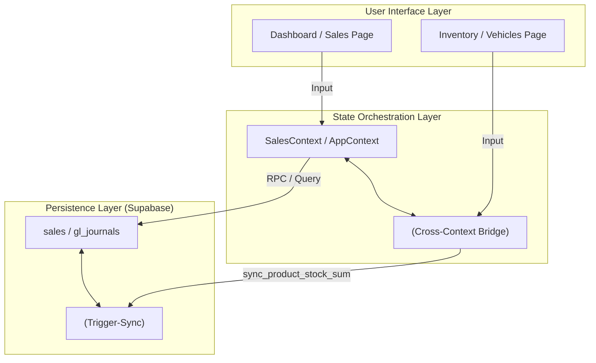

# Graphify Ecosystem Report: StockMate ERP

This is a comprehensive architectural map of the StockMate ecosystem, covering the React frontend, the Context orchestration layer, and the Supabase backend database.

## 1. Architectural God Nodes (Core Controllers)

| Node | Layer | Responsibility | Structural Weight |
| :--- | :--- | :--- | :--- |
| **[App.jsx](file:///Users/uvaizeba/.gemini/antigravity/scratch/StockMate/src/App.jsx)** | Routing | Entry point, routing, and provider nesting. | CRITICAL |
| **[AppContext.jsx](file:///Users/uvaizeba/.gemini/antigravity/scratch/StockMate/src/context/AppContext.jsx)** | Orchestration | Global state facade; coordinates modular contexts. | CRITICAL |
| **[SalesContext.jsx](file:///Users/uvaizeba/.gemini/antigravity/scratch/StockMate/src/context/SalesContext.jsx)** | Business | Handles primary revenue flow (Orders/Sales). | HIGH |
| **[supabase.js](file:///Users/uvaizeba/.gemini/antigravity/scratch/StockMate/src/lib/supabase.js)** | Infrastructure | Supabase Client initialization & configuration. | CRITICAL |

---

## 2. Functional Communities (Codebase Clusters)

### [Community] State & Sync (God Node: AppContext)
- **Members**: `AuthContext`, `TenantContext`, `SyncContext`, `NotificationContext`.
- **Logic**: Handles multi-tenant initialization, session management, and global background refresh.

### [Community] Trading & Financials (God Node: SalesContext)
- **Members**: `Sales`, `Invoices`, `Clients`, `ClientSettlement`, `PurchasesContext`, `FinanceContext`, `Suppliers`, `SupplierLedger`.
- **Logic**: Manages the General Ledger (GL) double-entry system, procurement, and accounts receivable.

### [Community] Inventory & Logistics (God Node: InventoryContext)
- **Members**: `Inventory`, `Vehicles`, `DayBook`, `InventoryReport`.
- **Logic**: Tracks stock across warehouses/vehicles and handles atomic movements of assets.

### [Community] Resource & Admin (God Node: HRContext)
- **Members**: `Users`, `Settings`, `AdminPanel`, `SuperAdminPortal`, `Payroll`.
- **Logic**: RBAC (Role-Based Access Control) enforcement, staff onboarding, and payroll processing.

---

## 3. Database Schema Mapping (Supabase)

The backend is organized into a modular, multi-tenant Postgres schema with strict RLS enforcement.

### [Table Cluster] Auth & Multi-Tenancy
- **God Table**: `tenants` (Managed by `TenantContext`)
- **Node**: `users` (Stores RBAC roles and permissions)
- **Mechanism**: **Row-Level Security (RLS)** isolates all rows via `tenant_id = public.current_tenant_id()`.

### [Table Cluster] General Ledger (Double-Entry)
- **God Table**: `gl_accounts` (The Chart of Accounts)
- **Relationship**: `gl_journals` (Heads) → `gl_lines` (Double-entry lines).
- **Automation**: Triggers automatically seed a default Chart of Accounts upon tenant creation.

### [Table Cluster] Commerce & Stock
- **God Table**: `products` (Stock is computed via trigger)
- **God Table**: `sales` & `purchases`.
- **Logic**: `inventory_balances` provides the single source of truth for stock levels across multiple locations.
- **RPCs**: `adjust_inventory_atomic` (Atomic stock moves), `transfer_inventory_atomic` (Location transfers).

---

## 4. Visual Cross-Layer Flow (Mermaid)

---

> [!TIP]
> **Pro-Tip**: When debugging stock discrepancies, skip the `products` table and audit `inventory_balances` + `movement_log`. The `products.stock` column is a cached sum managed by the `sync_product_stock_sum` trigger.

> [!IMPORTANT]
> **Data Integrity**: Financial integrity is maintained via the **Double-Entry GL System**. Every sale generates corresponding `gl_lines` to ensure the balance sheet remains consistent.
